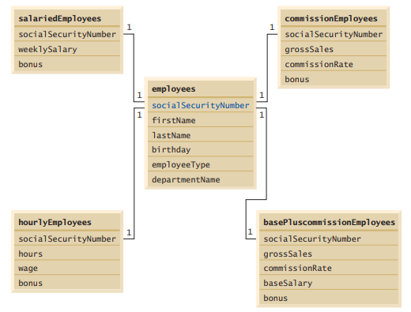

# Lab 08

1. Write an application that allows the user to:

a) Add employees to the employee table. 
b) Add payroll information to the appropriate table for each new employee. For example,
for a salaried employee add the payroll information to the salariedEmployees table.